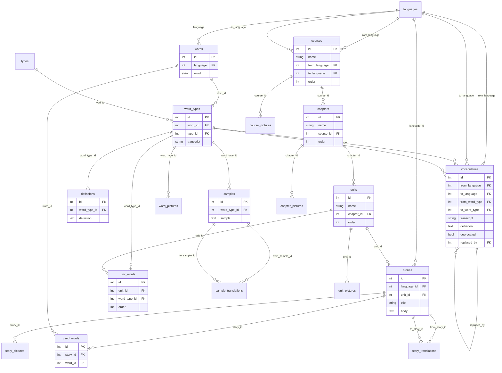

# Baza sxemasi (diagram)

`dictionary.db`ning joriy holatidan avtomatik chiqarilgan (PRAGMA `table_info`/`foreign_key_list` orqali). Matn tavsifi uchun [`database.md`](database.md)ga qarang.

## Yo'nalishlarni o'qish uchun eslatma

- `word_types` — markaziy jadval: deyarli hamma narsa (`definitions`, `samples`, `word_pictures`, `unit_words`, `vocabularies`) shu yerga ulanadi, `words`ga emas
- `vocabularies` ikki marta `word_types`ga ulanadi (`from_word_type`, `to_word_type`) — bitta jadval, ikkita rol
- `vocabularies.replaced_by` — o'ziga-o'zi bog'lanish (self-reference), `deprecated` tuzatilganda ishlatiladi
- `stories.unit_id` — endi bor (backfill qilindi), lekin `used_words.word_id` esa `words`ga bog'lanadi, `word_types`ga emas (chunki "qaysi ma'no" emas, shunchaki "qaysi so'z ishlatilgan")
